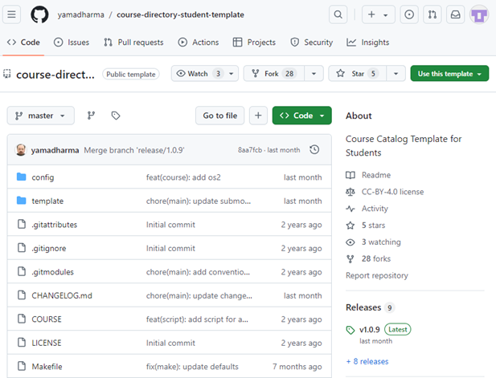
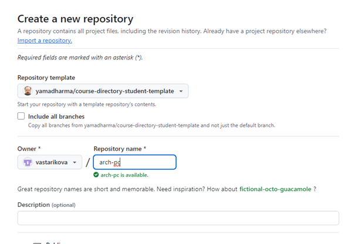
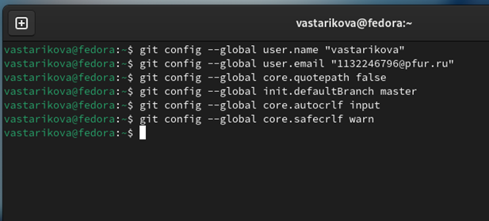
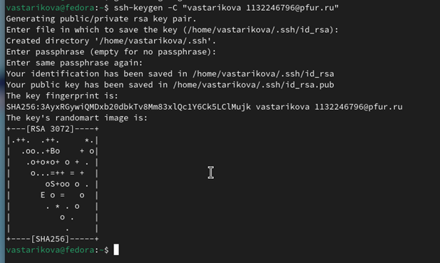
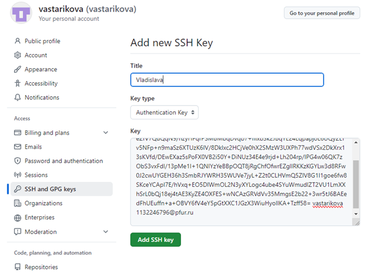
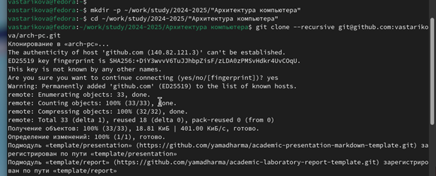
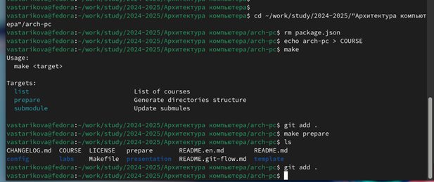
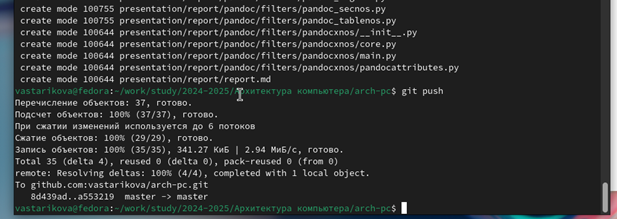
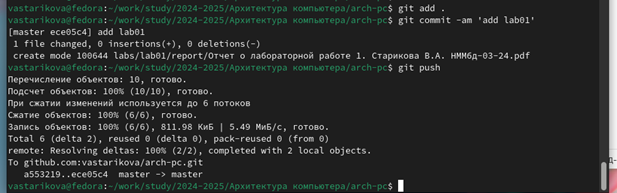
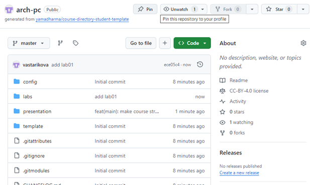

---
## Front matter
title: "Отчёт по лабораторной работе 2"
subtitle: "Архитектура компьютеров и операционные системы"
author: "Старикова Владислава Александровна НММбд-03-24"

## Generic otions
lang: ru-RU
toc-title: "Содержание"

## Bibliography
bibliography: bib/cite.bib
csl: pandoc/csl/gost-r-7-0-5-2008-numeric.csl

## Pdf output format
toc: true # Table of contents
toc-depth: 2
lof: true # List of figures
lot: true # List of tables
fontsize: 12pt
linestretch: 1.5
papersize: a4
documentclass: scrreprt
## I18n polyglossia
polyglossia-lang:
  name: russian
  options:
	- spelling=modern
	- babelshorthands=true
polyglossia-otherlangs:
  name: english
## I18n babel
babel-lang: russian
babel-otherlangs: english
## Fonts
mainfont: PT Serif
romanfont: PT Serif
sansfont: PT Sans
monofont: PT Mono
mainfontoptions: Ligatures=TeX
romanfontoptions: Ligatures=TeX
sansfontoptions: Ligatures=TeX,Scale=MatchLowercase
monofontoptions: Scale=MatchLowercase,Scale=0.9
## Biblatex
biblatex: true
biblio-style: "gost-numeric"
biblatexoptions:
  - parentracker=true
  - backend=biber
  - hyperref=auto
  - language=auto
  - autolang=other*
  - citestyle=gost-numeric
## Pandoc-crossref LaTeX customization
figureTitle: "Рис."
tableTitle: "Таблица"
listingTitle: "Листинг"
lofTitle: "Список иллюстраций"
lotTitle: "Список таблиц"
lolTitle: "Листинги"
## Misc options
indent: true
header-includes:
  - \usepackage{indentfirst}
  - \usepackage{float} # keep figures where there are in the text
  - \floatplacement{figure}{H} # keep figures where there are in the text
---

# Цель работы

Целью работы является изучить идеологию и применение средств контроля версий. Приобрести практические навыки по работе с системой git.

# Ход работы

Сначала я зарегистрировала учетную запись на GitHub, чтобы получить 
доступ к его функционалу. Затем приступила к созданию репозитория, 
выбрав шаблонный репозиторий преподавателя 
Дмитрия Сергеевича Кулябова. (рис. [-@fig:001]) (рис. [-@fig:002]) (рис. [-@fig:003])

{ #fig:001 width=70%, height=70% }

{ #fig:002 width=70%, height=70% }

{ #fig:003 width=70%, height=70% }

Далее настроила подключение к репозиторию из системы Linux. 
Для этого задала параметры пользователя и коммитов и создала SSH-ключ, который понадобился для безопасной авторизации.
(рис. [-@fig:004]) (рис. [-@fig:005])

{ #fig:004 width=70%, height=70% }

{ #fig:005 width=70%, height=70% }

После создания SSH-ключа добавила его в свой профиль на GitHub, чтобы платформа могла 
распознавать меня при каждом подключении по ключу. (рис. [-@fig:006])

{ #fig:006 width=70%, height=70% }

Следующим шагом я создала локальную папку на компьютере и клонировала в нее содержимое репозитория. 
Этот процесс позволил мне перенести шаблон на локальный диск. (рис. [-@fig:007])

{ #fig:007 width=70%, height=70% }

Затем я сделала структуру папок курса 
с использованием make и загрузила в сетевой репозиторий. 
(рис. [-@fig:008]) (рис. [-@fig:009])

{ #fig:008 width=70%, height=70% }

{ #fig:009 width=70%, height=70% }

Помимо этого, загрузила отчеты по проделанным заданиям.
(рис. [-@fig:010])

{ #fig:010 width=70%, height=70% }

{ #fig:011 width=70%, height=70% }

# Выводы

В процессе работы я освоила основные принципы работы с GitHub, а также получила опыт работы с системой контроля версий.
