---
## Front matter
title: "Отчёт по лабораторной работе 3"
subtitle: "Архитектура компьютеров и операционные системы"
author: "Старикова Владислава Александровна НММбд-03-24"

## Generic otions
lang: ru-RU
toc-title: "Содержание"

## Bibliography
bibliography: bib/cite.bib
csl: pandoc/csl/gost-r-7-0-5-2008-numeric.csl

## Pdf output format
toc: true # Table of contents
toc-depth: 2
lof: true # List of figures
lot: true # List of tables
fontsize: 12pt
linestretch: 1.5
papersize: a4
documentclass: scrreprt
## I18n polyglossia
polyglossia-lang:
  name: russian
  options:
	- spelling=modern
	- babelshorthands=true
polyglossia-otherlangs:
  name: english
## I18n babel
babel-lang: russian
babel-otherlangs: english
## Fonts
mainfont: PT Serif
romanfont: PT Serif
sansfont: PT Sans
monofont: PT Mono
mainfontoptions: Ligatures=TeX
romanfontoptions: Ligatures=TeX
sansfontoptions: Ligatures=TeX,Scale=MatchLowercase
monofontoptions: Scale=MatchLowercase,Scale=0.9
## Biblatex
biblatex: true
biblio-style: "gost-numeric"
biblatexoptions:
  - parentracker=true
  - backend=biber
  - hyperref=auto
  - language=auto
  - autolang=other*
  - citestyle=gost-numeric
## Pandoc-crossref LaTeX customization
figureTitle: "Рис."
tableTitle: "Таблица"
listingTitle: "Листинг"
lofTitle: "Список иллюстраций"
lotTitle: "Список таблиц"
lolTitle: "Листинги"
## Misc options
indent: true
header-includes:
  - \usepackage{indentfirst}
  - \usepackage{float} # keep figures where there are in the text
  - \floatplacement{figure}{H} # keep figures where there are in the text
---

# Цель работы

Овладевание процессом оформления отчетов с использованием простого языка разметки Markdown.

# Ход работы

Установила программы pandoc и TexLive по указаниям в лабораторной работе. 

Открыла терминал.

Перешла в каталог курса, который был сформирован при выполнении лабораторной работы №3. Обновила локальный репозиторий, скачав изменения из удаленного репозитория.

Перешла в каталог с шаблоном отчета по лабораторной работе №3. (рис. [-@fig:001])

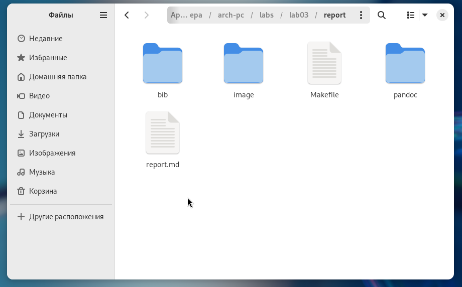{ #fig:001 width=70%, height=70% }

Выполнила компиляцию шаблона с использованием Makefile. 
Для этого ввела команду make. (рис. [-@fig:002])
После успешной компиляции были сгенерированы файлы report.pdf и report.docx. 
Открыла и проверила корректность полученных файлов. (рис. [-@fig:003])

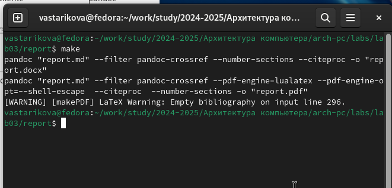{ #fig:002 width=70%, height=70% }

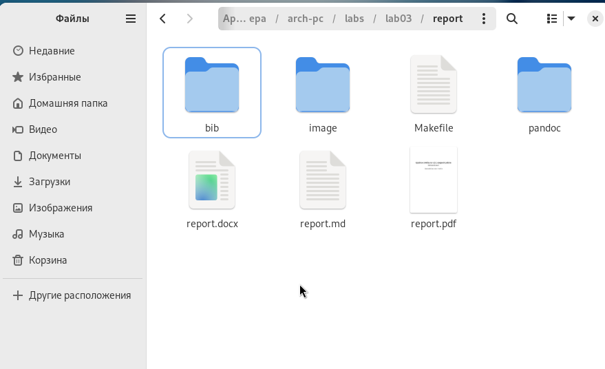{ #fig:003 width=70%, height=70% }

Удалила полученные файлы с использованием Makefile. 
Для этого ввела команду make clean. (рис. [-@fig:004])
Проверила, что после выполнения этой команды файлы report.pdf и report.docx были удалены.

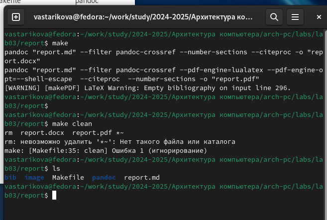{ #fig:004 width=70%, height=70% }

Открыла файл report.md с помощью текстового редактора gedit. 
Внимательно изучила структуру этого файла. 
(рис. [-@fig:005], рис. [-@fig:006], рис. [-@fig:007], рис. [-@fig:008])

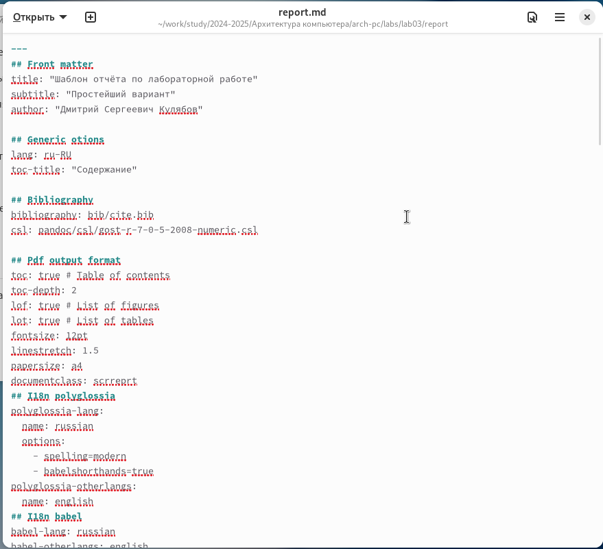{ #fig:005 width=70%, height=70% }

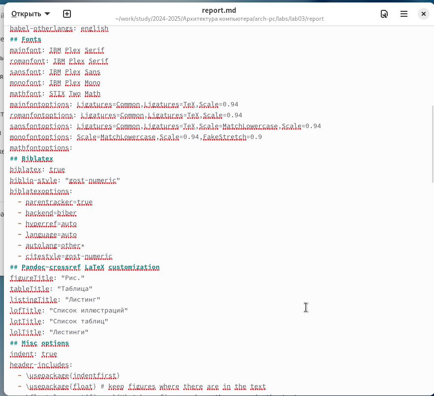{ #fig:006 width=70%, height=70% }

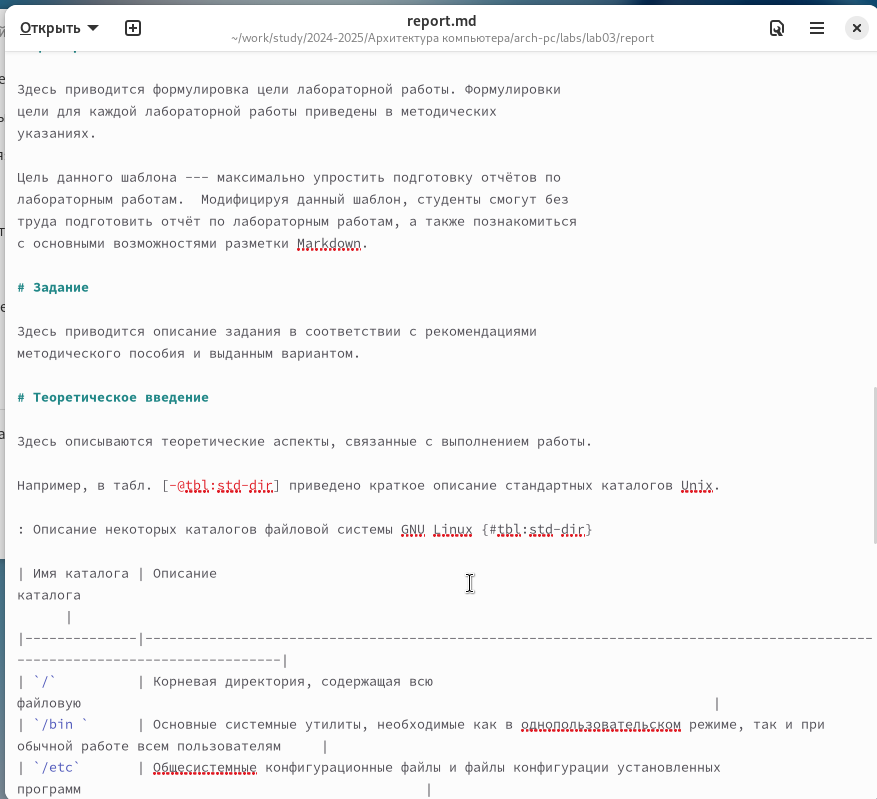{ #fig:007 width=70%, height=70% }

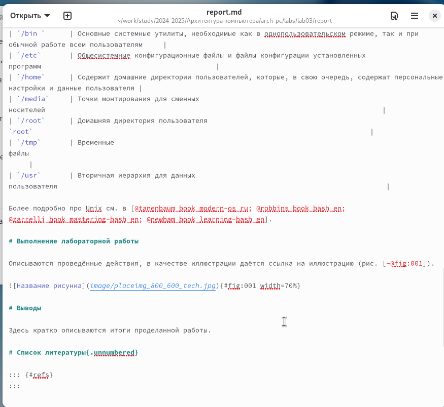{ #fig:008 width=70%, height=70% }

Заполнила отчет и скомпилировала его с использованием Makefile. 
Проверила корректность полученных файлов. 
(рис. [-@fig:009], рис. [-@fig:010], рис. [-@fig:011])

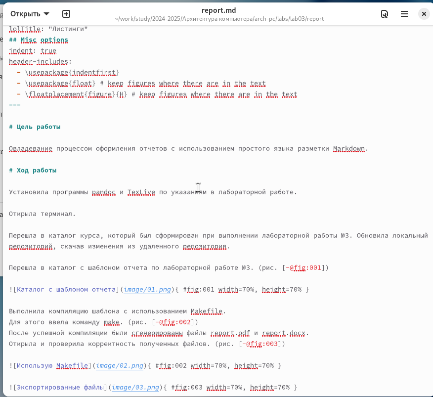{ #fig:009 width=70%, height=70% }

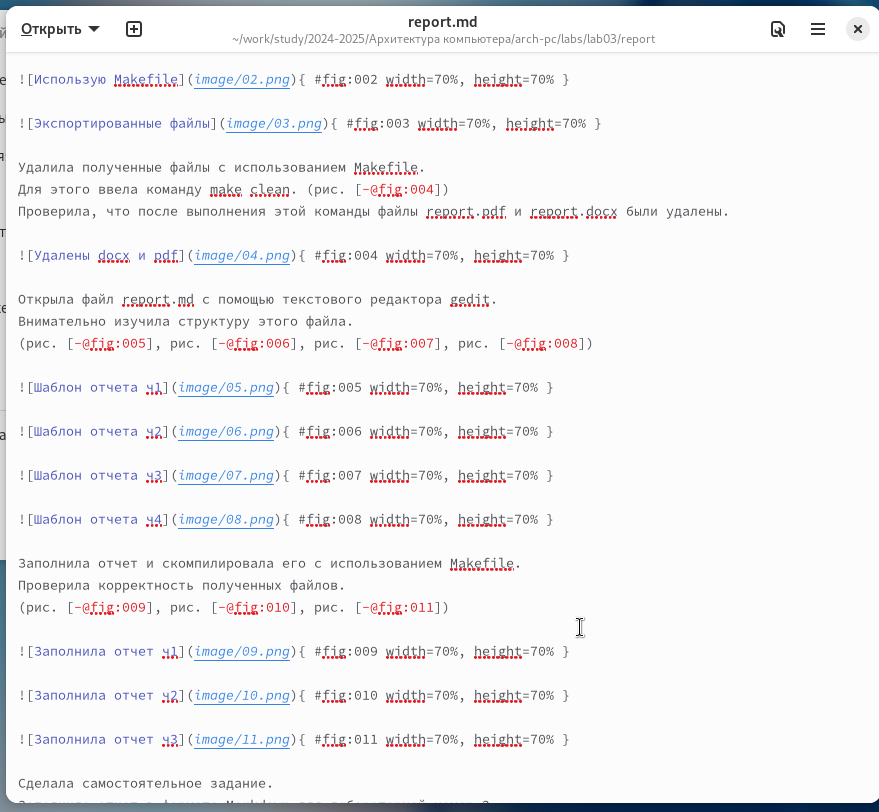{ #fig:010 width=70%, height=70% }

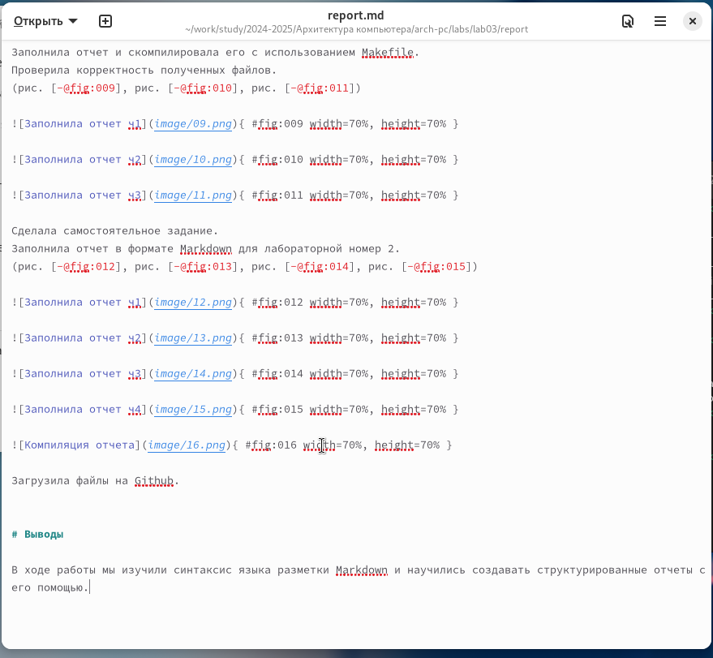{ #fig:011 width=70%, height=70% }

Сделала самостоятельное задание.
Заполнила отчет в формате Markdown для лабораторной номер 2.
(рис. [-@fig:012], рис. [-@fig:013], рис. [-@fig:014], рис. [-@fig:015])

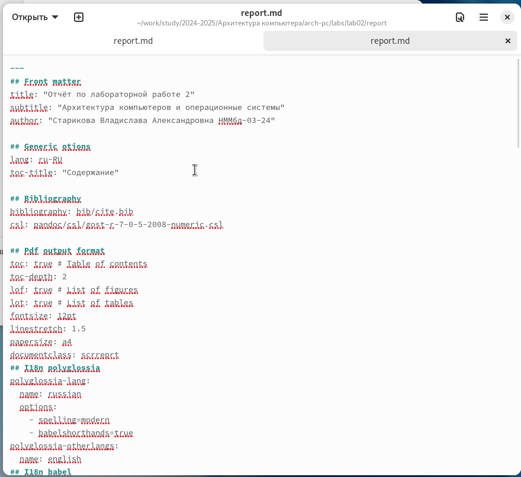{ #fig:012 width=70%, height=70% }

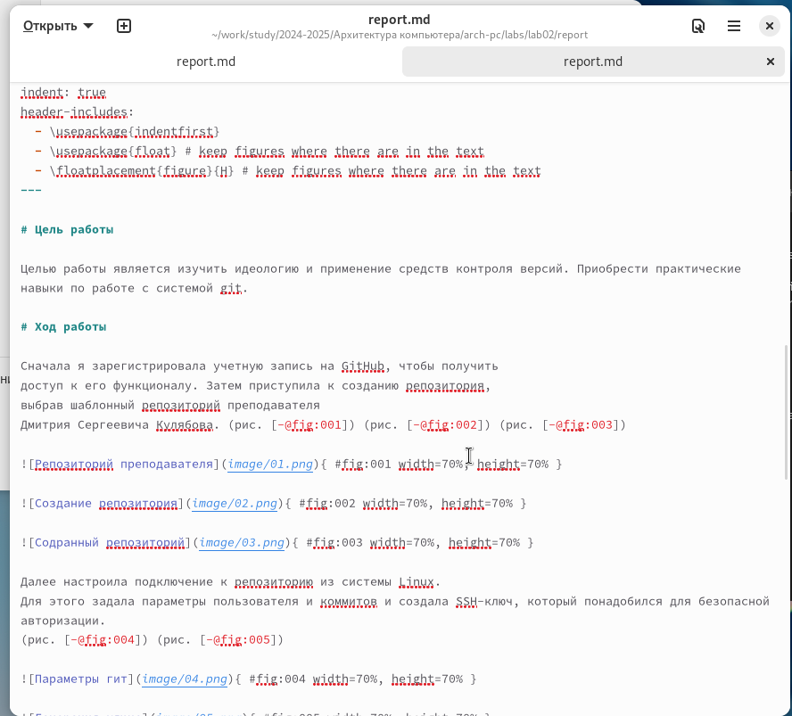{ #fig:013 width=70%, height=70% }

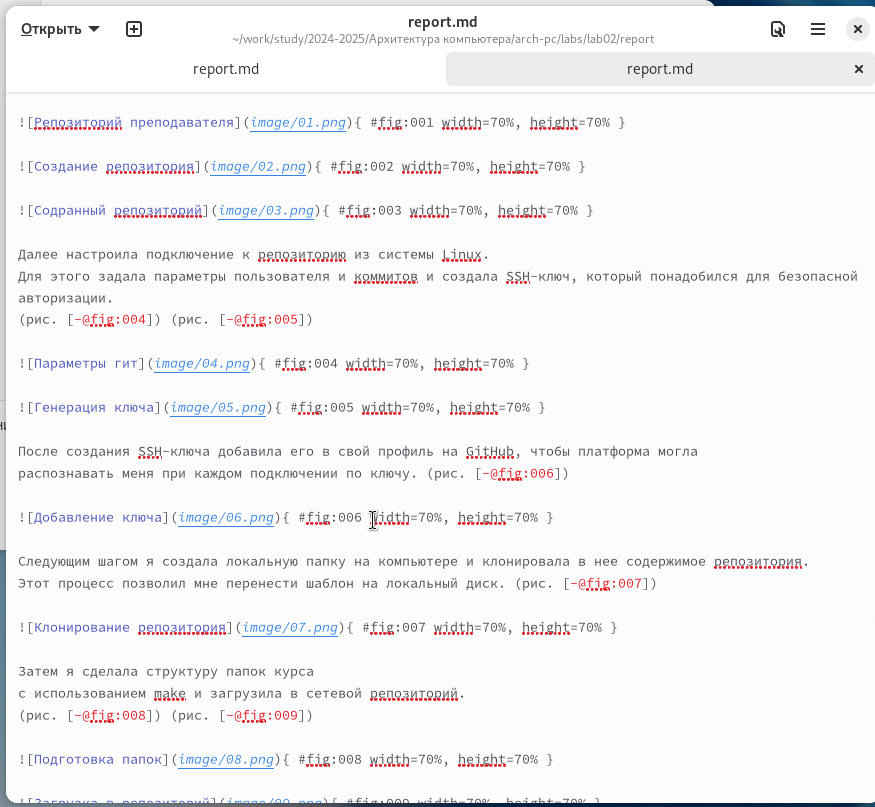{ #fig:014 width=70%, height=70% }

{ #fig:015 width=70%, height=70% }

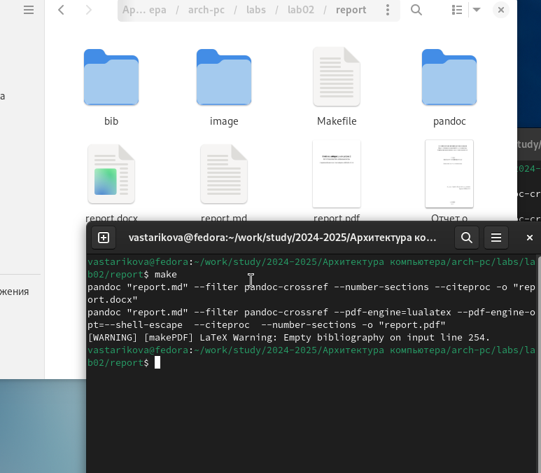{ #fig:016 width=70%, height=70% }

Загрузила файлы на Github.

# Выводы

В ходе работы мы изучили синтаксис языка разметки Markdown и научились создавать структурированные отчеты с его помощью.
