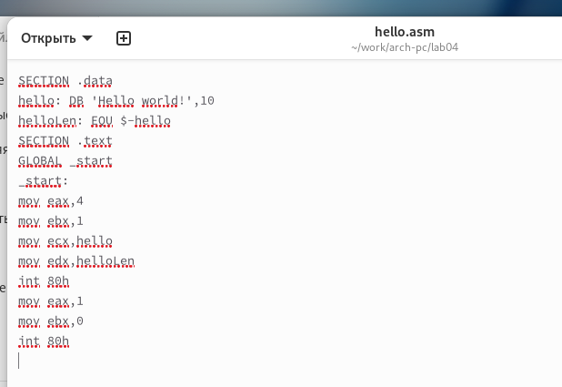
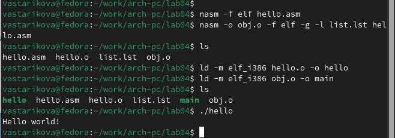
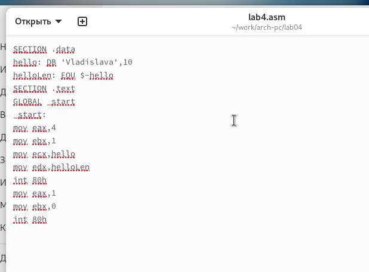

---
## Front matter
title: "Отчёт по лабораторной работе 4"
subtitle: "Архитектура компьютеров и операционные системы"
author: "Старикова Владислава Александровна НММбд-03-24"

## Generic otions
lang: ru-RU
toc-title: "Содержание"

## Bibliography
bibliography: bib/cite.bib
csl: pandoc/csl/gost-r-7-0-5-2008-numeric.csl

## Pdf output format
toc: true # Table of contents
toc-depth: 2
lof: true # List of figures
lot: true # List of tables
fontsize: 12pt
linestretch: 1.5
papersize: a4
documentclass: scrreprt
## I18n polyglossia
polyglossia-lang:
  name: russian
  options:
	- spelling=modern
	- babelshorthands=true
polyglossia-otherlangs:
  name: english
## I18n babel
babel-lang: russian
babel-otherlangs: english
## Fonts
mainfont: PT Serif
romanfont: PT Serif
sansfont: PT Sans
monofont: PT Mono
mainfontoptions: Ligatures=TeX
romanfontoptions: Ligatures=TeX
sansfontoptions: Ligatures=TeX,Scale=MatchLowercase
monofontoptions: Scale=MatchLowercase,Scale=0.9
## Biblatex
biblatex: true
biblio-style: "gost-numeric"
biblatexoptions:
  - parentracker=true
  - backend=biber
  - hyperref=auto
  - language=auto
  - autolang=other*
  - citestyle=gost-numeric
## Pandoc-crossref LaTeX customization
figureTitle: "Рис."
tableTitle: "Таблица"
listingTitle: "Листинг"
lofTitle: "Список иллюстраций"
lotTitle: "Список таблиц"
lolTitle: "Листинги"
## Misc options
indent: true
header-includes:
  - \usepackage{indentfirst}
  - \usepackage{float} # keep figures where there are in the text
  - \floatplacement{figure}{H} # keep figures where there are in the text
---

# Цель работы

Целью данной работы является освоение процесса компиляции и сборки программ, написанных на ассемблере NASM.

# Выполнение лабораторной работы

Я создала каталог `lab04` с помощью команды `mkdir`, затем перешла в него с помощью команды `cd` и создала файл `hello.asm`.  
(рис. [-@fig:001])

{ #fig:001 width=70%, height=70% }

Открыла файл и написала код программы согласно заданию.  
(рис. [-@fig:002])

{ #fig:002 width=70%, height=70% }

С помощью команды `nasm` я выполнила трансляцию файла, в результате чего был создан объектный файл `hello.o`.

Затем повторно выполнила трансляцию с использованием дополнительных опций команды `nasm`. В результате этой операции были созданы файл листинга `list.lst`, объектный файл `obj.o`, и в программу была добавлена отладочная информация.

С помощью команды `ld` выполнила линковку и получила исполняемый файл.

Еще раз выполнила линковку для объектного файла `obj.o` и получила исполняемый файл с именем `main`.

После этого запустила оба исполняемых файла и проверила их корректную работу.  
(рис. [-@fig:003])

{ #fig:003 width=70%, height=70% }

Для выполнения задания изменила сообщение "Hello world" на своё имя, после чего запустила программу снова.  
(рис. [-@fig:004])  
(рис. [-@fig:005])

{ #fig:004 width=70%, height=70% }

{ #fig:005 width=70%, height=70% }

# Выводы

В результате выполнения лабораторной работы я освоила процесс компиляции и сборки программ на ассемблере NASM, а также научилась трансляции, линковке и добавлению отладочной информации. Также успешно изменила код программы для вывода собственного сообщения.
