---
## Front matter
title: "Отчёт по лабораторной работе 5"
subtitle: "Архитектура компьютеров и операционные системы"
author: "Старикова Владислава Александровна НММбд-03-24"

## Generic otions
lang: ru-RU
toc-title: "Содержание"

## Bibliography
bibliography: bib/cite.bib
csl: pandoc/csl/gost-r-7-0-5-2008-numeric.csl

## Pdf output format
toc: true # Table of contents
toc-depth: 2
lof: true # List of figures
lot: true # List of tables
fontsize: 12pt
linestretch: 1.5
papersize: a4
documentclass: scrreprt
## I18n polyglossia
polyglossia-lang:
  name: russian
  options:
	- spelling=modern
	- babelshorthands=true
polyglossia-otherlangs:
  name: english
## I18n babel
babel-lang: russian
babel-otherlangs: english
## Fonts
mainfont: PT Serif
romanfont: PT Serif
sansfont: PT Sans
monofont: PT Mono
mainfontoptions: Ligatures=TeX
romanfontoptions: Ligatures=TeX
sansfontoptions: Ligatures=TeX,Scale=MatchLowercase
monofontoptions: Scale=MatchLowercase,Scale=0.9
## Biblatex
biblatex: true
biblio-style: "gost-numeric"
biblatexoptions:
  - parentracker=true
  - backend=biber
  - hyperref=auto
  - language=auto
  - autolang=other*
  - citestyle=gost-numeric
## Pandoc-crossref LaTeX customization
figureTitle: "Рис."
tableTitle: "Таблица"
listingTitle: "Листинг"
lofTitle: "Список иллюстраций"
lotTitle: "Список таблиц"
lolTitle: "Листинги"
## Misc options
indent: true
header-includes:
  - \usepackage{indentfirst}
  - \usepackage{float} # keep figures where there are in the text
  - \floatplacement{figure}{H} # keep figures where there are in the text
---

# Цель работы

Целью работы является приобретение практических навыков работы в Midnight Commander. 
Освоение инструкций языка ассемблера mov и int.

# Выполнение лабораторной работы

Я открыла Midnight Commander.  
Перешла в каталог ~/work/arch-pc.  
Создала каталог lab05 (рис. [-@fig:001]).

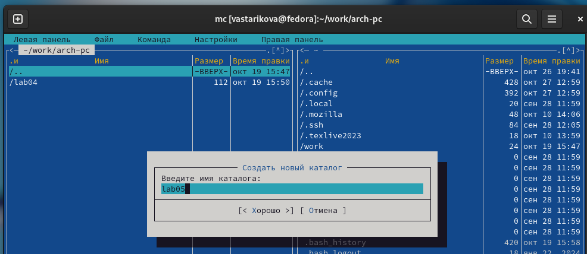{ #fig:001 width=70%, height=70% }

Создала файл lab05-1.asm (рис. [-@fig:002]).

{ #fig:002 width=70%, height=70% }

Открыла файл на редактирование и написала код (рис. [-@fig:003]).

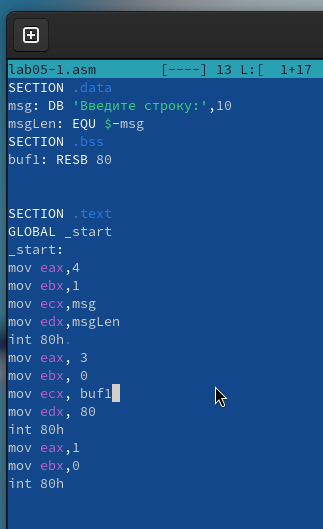{ #fig:003 width=70%, height=70% }

Открыла файл для просмотра и убедилась, что он содержит написанный код (рис. [-@fig:004]).

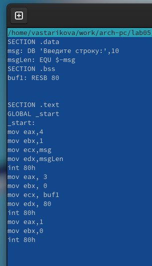{ #fig:004 width=70%, height=70% }

Получила исполняемый файл программы и проверила его работу (рис. [-@fig:005]).

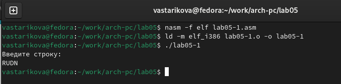{ #fig:005 width=70%, height=70% }

Скачала файл in_out.asm. Добавила его в рабочий каталог.  
Скопировала lab05-1.asm в lab05-2.asm (рис. [-@fig:006]).

{ #fig:006 width=70%, height=70% }

Написала код программы lab05-2.asm (рис. [-@fig:007]).  
Скомпилировала программу и проверила запуск (рис. [-@fig:008]).

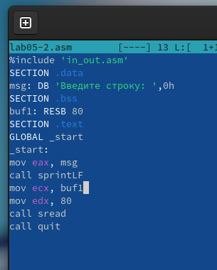{ #fig:007 width=70%, height=70% }

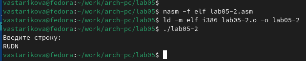{ #fig:008 width=70%, height=70% }

В файле lab05-2.asm я заменила подпрограмму sprintLF на sprint (рис. [-@fig:009]).  
Затем я снова собрала исполняемый файл (рис. [-@fig:010]).  
Теперь после вывода строки она не завершается символом перехода на новую строку.

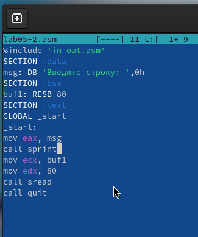{ #fig:009 width=70%, height=70% }

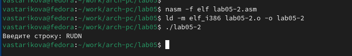{ #fig:010 width=70%, height=70% }

Скопировала программу lab05-1.asm и изменила код, чтобы программа выводила 
приглашение типа "Введите строку:", затем считывала строку с клавиатуры 
и выводила введенную строку на экран (рис. [-@fig:011], рис. [-@fig:012]).

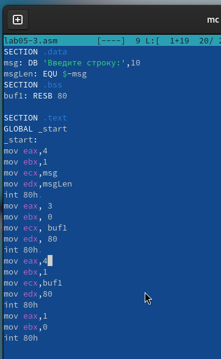{ #fig:011 width=70%, height=70% }

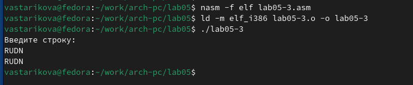{ #fig:012 width=70%, height=70% }

Также я скопировала программу lab05-2.asm и внесла соответствующие изменения в код, 
чтобы программа выводила приглашение типа "Введите строку:", 
затем считывала строку с клавиатуры и выводила введенную строку на экран (рис. [-@fig:013], рис. [-@fig:014]).

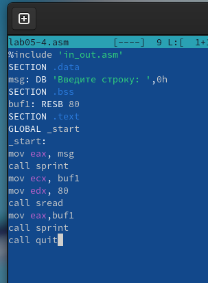{ #fig:013 width=70%, height=70% }

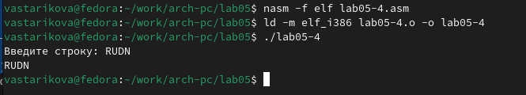{ #fig:014 width=70%, height=70% }

Отличие этих двух реализаций заключается в том, что файл in_out.asm содержит уже 
готовые подпрограммы для обеспечения ввода/вывода. 
Таким образом, нам остается только разместить данные в нужных регистрах и 
вызвать желаемую подпрограмму с помощью инструкции call.

# Выводы

Научились писать базовые ассемблерные программы. Освоили ассемблерные инструкции mov и int.