---
## Front matter
title: "Отчёт по лабораторной работе 7"
subtitle: "Архитектура компьютеров и операционные системы"
author: "Старикова Владислава Александровна НММбд-03-24"

## Generic otions
lang: ru-RU
toc-title: "Содержание"

## Bibliography
bibliography: bib/cite.bib
csl: pandoc/csl/gost-r-7-0-5-2008-numeric.csl

## Pdf output format
toc: true # Table of contents
toc-depth: 2
lof: true # List of figures
lot: true # List of tables
fontsize: 12pt
linestretch: 1.5
papersize: a4
documentclass: scrreprt
## I18n polyglossia
polyglossia-lang:
  name: russian
  options:
	- spelling=modern
	- babelshorthands=true
polyglossia-otherlangs:
  name: english
## I18n babel
babel-lang: russian
babel-otherlangs: english
## Fonts
mainfont: PT Serif
romanfont: PT Serif
sansfont: PT Sans
monofont: PT Mono
mainfontoptions: Ligatures=TeX
romanfontoptions: Ligatures=TeX
sansfontoptions: Ligatures=TeX,Scale=MatchLowercase
monofontoptions: Scale=MatchLowercase,Scale=0.9
## Biblatex
biblatex: true
biblio-style: "gost-numeric"
biblatexoptions:
  - parentracker=true
  - backend=biber
  - hyperref=auto
  - language=auto
  - autolang=other*
  - citestyle=gost-numeric
## Pandoc-crossref LaTeX customization
figureTitle: "Рис."
tableTitle: "Таблица"
listingTitle: "Листинг"
lofTitle: "Список иллюстраций"
lotTitle: "Список таблиц"
lolTitle: "Листинги"
## Misc options
indent: true
header-includes:
  - \usepackage{indentfirst}
  - \usepackage{float} # keep figures where there are in the text
  - \floatplacement{figure}{H} # keep figures where there are in the text
---

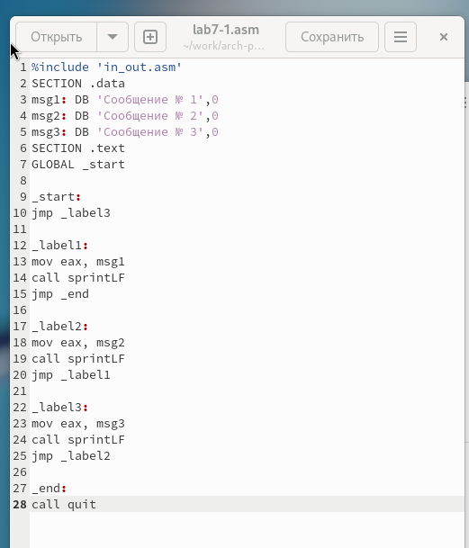{ #fig:006 width=70%, height=70% }

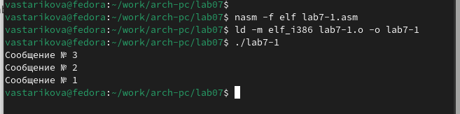{ #fig:007 width=70%, height=70% }

Использование инструкции jmp приводит к переходу в любом случае. Однако часто при написании программ требуется использовать условные переходы, когда переход должен происходить при выполнении какого-либо условия. В качестве примера рассмотрим программу, которая находит и выводит на экран наибольшую из 3 целочисленных переменных: A, B и C. Значения для A и C заданы в программе, значение B вводится с клавиатуры.

Я создала исполняемый файл и проверила его работу для разных значений B (рис. [-@fig:008]) (рис. [-@fig:009]).

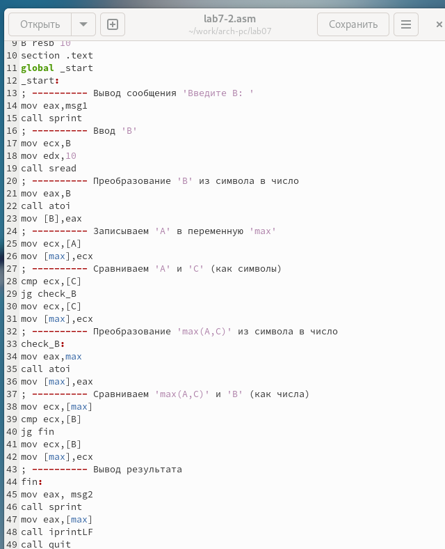{ #fig:008 width=70%, height=70% }

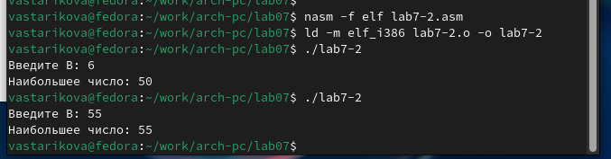{ #fig:009 width=70%, height=70% }

Обычно nasm создает в результате ассемблирования только объектный файл. Чтобы получить файл листинга, нужно указать ключ -l и задать имя файла листинга в командной строке.

Я создала файл листинга для программы из файла lab7-2.asm (рис. [-@fig:010])

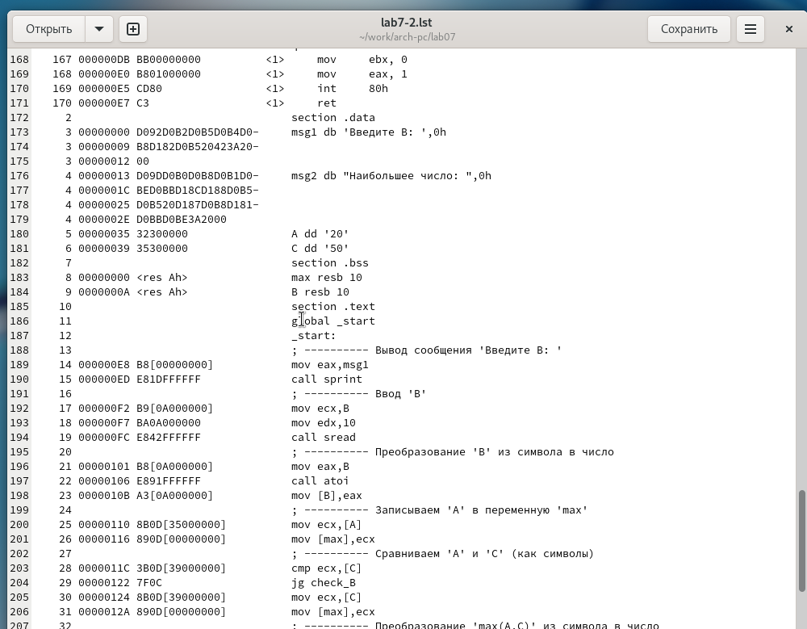{ #fig:010 width=70%, height=70% }

Внимательно ознакомилась с его форматом и содержимым. Подробно объяснила содержимое трёх строк файла листинга.

строка 189:
- 14 — номер строки в подпрограмме
- 000000E8 — адрес
- B8[00000000] — машинный код
- mov eax,msg1 — код программы — перекладывает msg1 в eax

строка 190:
- 15 — номер строки в подпрограмме
- 000000ED — адрес
- E81DFFFFFF — машинный код
- call sprint — код программы — вызов подпрограммы печати

строка 192:
- 17 — номер строки в подпрограмме
- 000000F2 — адрес
- B9[0A000000] — машинный код
- mov ecx,B — код программы — перекладывает B в eax

Я открыла файл с программой lab7-2.asm и в инструкции с двумя операндами удалила один операнд. Выполнила трансляцию с получением файла листинга. (рис. [-@fig:011]) (рис. [-@fig:012])

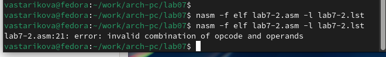{ #fig:011 width=70%, height=70% }

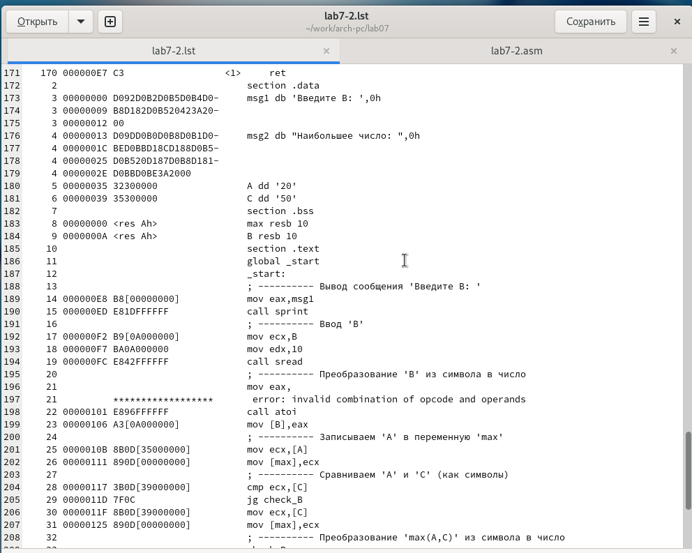{ #fig:012 width=70%, height=70% }

Объектный файл не смог создаться из-за ошибки. Однако я получила листинг, в котором выделено место ошибки.

## Самостоятельное задание

Напиши программу нахождения наименьшей из 3 целочисленных переменных a, b и c. Значения переменных выбрать из табл. 7.5 в соответствии с вариантом, полученным при выполнении лабораторной работы № 6. Создаю исполняемый файл и проверяю его работу (рис. [-@fig:013]) (рис. [-@fig:014]).

для варианта 17 — 26,12,68

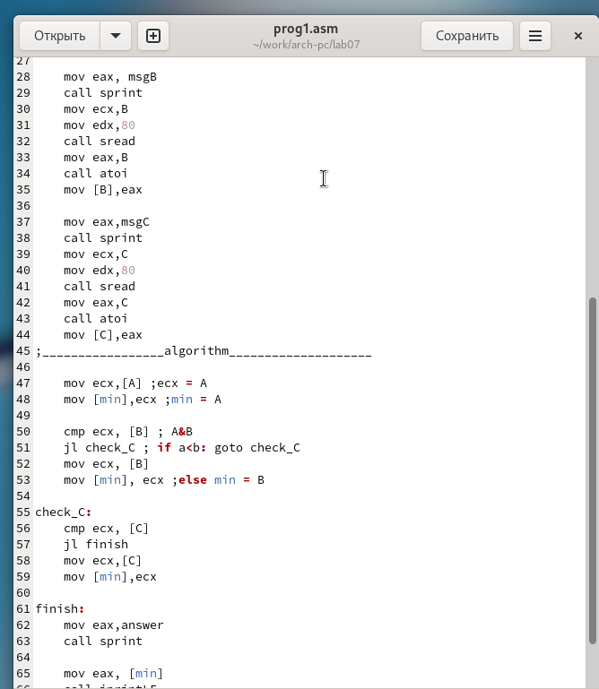{ #fig:013 width=70%, height=70% }

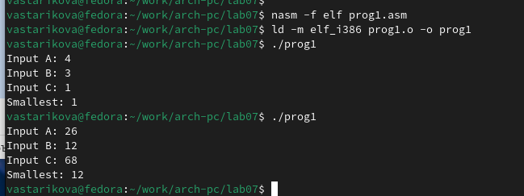{ #fig:014 width=70%, height=70% }

Теперь пишу программу, которая для введённых с клавиатуры значений x и a вычисляет значение заданной функции f(x) и выводит результат вычислений. Вид функции f(x) выбираю из таблицы 7.6 вариантов заданий в соответствии с вариантом, полученным при выполнении лабораторной работы № 7. Создаю исполняемый файл и проверяю его работу для значений X и a из 7.6. (рис. [-@fig:015]) (рис. [-@fig:016]).

для варианта 17:

$$
 \begin{cases}
	a+8, a < 8 \\
	ax, a \ge 8
 \end{cases}
$$

Если подставить $x=3, a=4$ получается $4+8 = 12$.

Если подставить $x=2, a=9$ получается $2*9 = 18$.

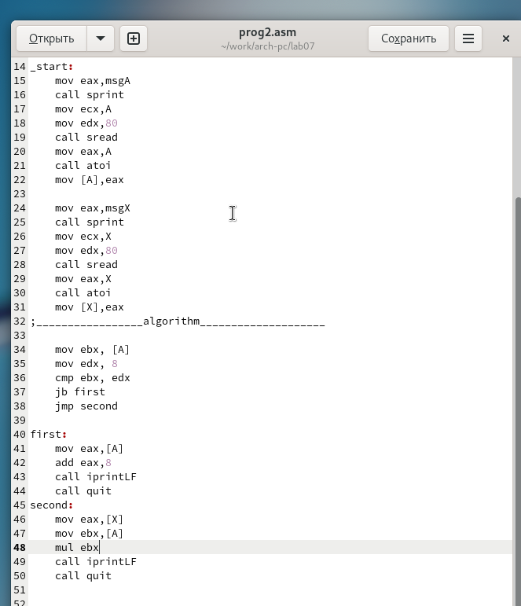{ #fig:015 width=70%, height=70% }

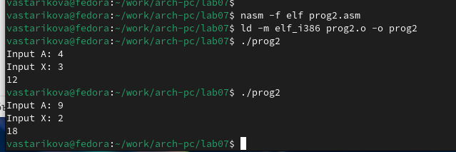{ #fig:016 width=70%, height=70% }

# Выводы

Изучили команды условного и безусловного переходов, познакомились с фалом листинга.