---
## Front matter
title: "Отчёт по лабораторной работе 8"
subtitle: "Архитектура компьютеров и операционные системы"
author: "Старикова Владислава Александровна НММбд-03-24"

## Generic otions
lang: ru-RU
toc-title: "Содержание"

## Bibliography
bibliography: bib/cite.bib
csl: pandoc/csl/gost-r-7-0-5-2008-numeric.csl

## Pdf output format
toc: true # Table of contents
toc-depth: 2
lof: true # List of figures
lot: true # List of tables
fontsize: 12pt
linestretch: 1.5
papersize: a4
documentclass: scrreprt
## I18n polyglossia
polyglossia-lang:
  name: russian
  options:
	- spelling=modern
	- babelshorthands=true
polyglossia-otherlangs:
  name: english
## I18n babel
babel-lang: russian
babel-otherlangs: english
## Fonts
mainfont: PT Serif
romanfont: PT Serif
sansfont: PT Sans
monofont: PT Mono
mainfontoptions: Ligatures=TeX
romanfontoptions: Ligatures=TeX
sansfontoptions: Ligatures=TeX,Scale=MatchLowercase
monofontoptions: Scale=MatchLowercase,Scale=0.9
## Biblatex
biblatex: true
biblio-style: "gost-numeric"
biblatexoptions:
  - parentracker=trueЗырянов Артём Алексеевич	НБИбд-01-22

  - backend=biber
  - hyperref=auto
  - language=auto
  - autolang=other*
  - citestyle=gost-numeric
## Pandoc-crossref LaTeX customization
figureTitle: "Рис."
tableTitle: "Таблица"
listingTitle: "Листинг"
lofTitle: "Список иллюстраций"
lotTitle: "Список таблиц"
lolTitle: "Листинги"
## Misc options
indent: true
header-includes:
  - \usepackage{indentfirst}
  - \usepackage{float} # keep figures where there are in the text
  - \floatplacement{figure}{H} # keep figures where there are in the text
---

# Цель работы

Целью работы является приобретение навыков написания программ с использованием циклов и обработкой аргументов командной строки..

# Выполнение лабораторной работы

Создала каталог для программ лабораторной работы №8 и файл lab8-1.asm.

При реализации циклов в NASM с использованием инструкции loop следует учитывать, что данная инструкция использует регистр ecx в качестве счетчика и на каждом шаге уменьшает его значение на единицу. Рассмотрим пример программы, выводящей значение регистра ecx.

Добавила в файл lab8-1.asm текст программы из листинга 8.1 (рис. [-@fig:001]).  
Создала исполняемый файл и проверила его работу (рис. [-@fig:002]).

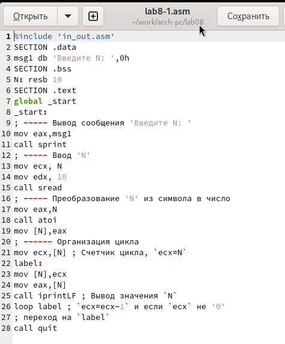{ #fig:001 width=70%, height=70% }

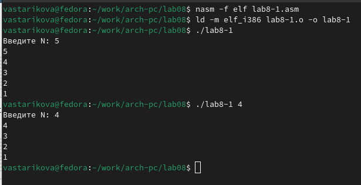{ #fig:002 width=70%, height=70% }

Пример демонстрирует, что использование регистра ecx внутри цикла loop может привести к некорректной работе программы. Изменила текст программы, добавив модификацию значения регистра ecx внутри цикла (рис. [-@fig:003]).

Теперь программа запускает бесконечный цикл при нечетном N и выводит только нечетные числа при четном N (рис. [-@fig:004]).

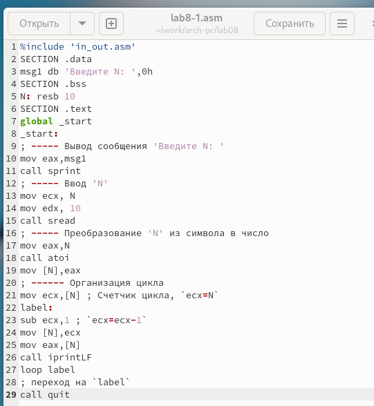{ #fig:003 width=70%, height=70% }

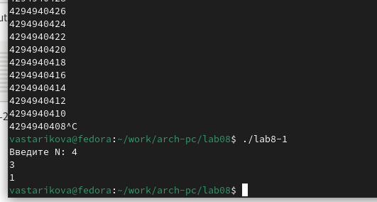{ #fig:004 width=70%, height=70% }

Для корректной работы программы при использовании регистра ecx в цикле можно применять стек. Внесла изменения в текст программы, добавив команды push и pop для сохранения значения регистра ecx (рис. [-@fig:005]).

Создала исполняемый файл и проверила его работу. Программа корректно выводит числа от N-1 до 0, при этом число проходов цикла соответствует значению N (рис. [-@fig:006]).

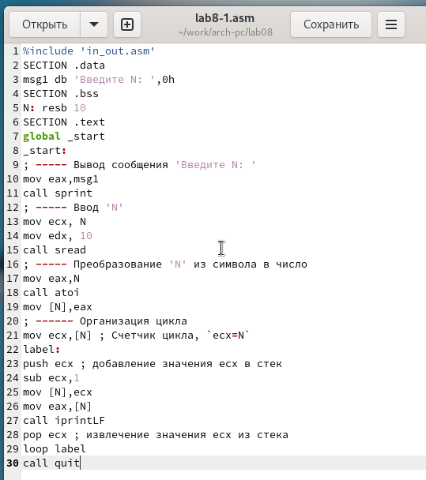{ #fig:005 width=70%, height=70% }

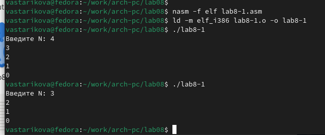{ #fig:006 width=70%, height=70% }

Создала файл lab8-2.asm в каталоге ~/work/arch-pc/lab08 и ввела в него текст программы из листинга 8.2 (рис. [-@fig:007]).

Создала исполняемый файл и запустила его, указав аргументы. 
Программа обработала 4 аргумента, которые интерпретируются как слова/числа, разделенные пробелом (рис. [-@fig:008]).

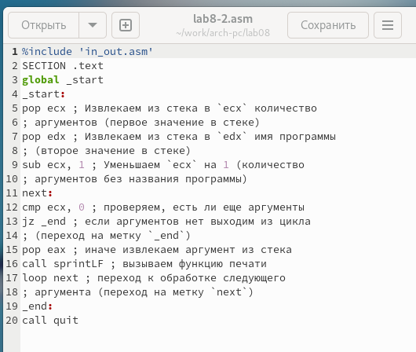{ #fig:007 width=70%, height=70% }

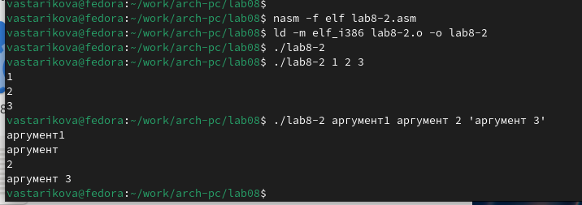{ #fig:008 width=70%, height=70% }

Рассмотрим еще один пример программы, вычисляющей сумму чисел, переданных в качестве аргументов командной строки (рис. [-@fig:009], [-@fig:010]).

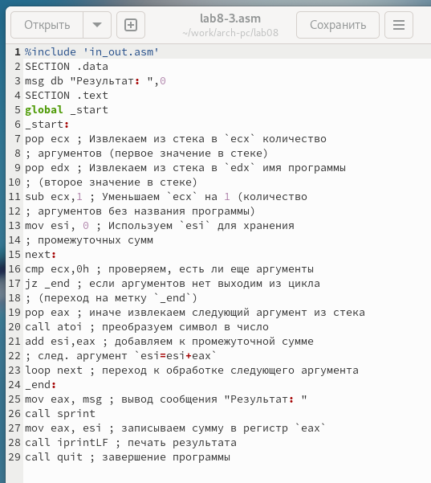{ #fig:009 width=70%, height=70% }

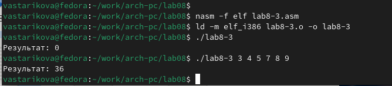{ #fig:010 width=70%, height=70% }

Изменила текст программы из листинга 8.3, чтобы вычислять произведение аргументов командной строки (рис. [-@fig:011], [-@fig:012]).

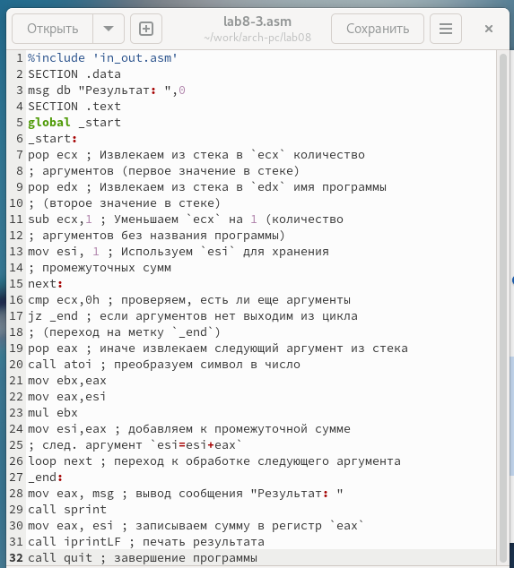{ #fig:011 width=70%, height=70% }

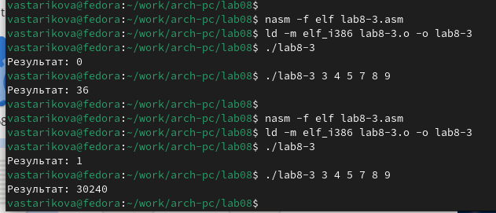{ #fig:012 width=70%, height=70% }

## Самостоятельное задание

Разработала программу для вычисления суммы значений функции $f(x)$ для $x = x_1, x_2, ..., x_n$.  
Программа выводит результат вычисления $f(x_1) + f(x_2) + ... + f(x_n)$, где значения $x$ передаются в качестве аргументов.  
Функция $f(x)$ соответствует варианту задания из лабораторной работы №7.

Для варианта 17: $$f(x) = 10(x-1)$$

Создала исполняемый файл и проверила работу программы на различных наборах значений $x$ (рис. [-@fig:013], [-@fig:014]).

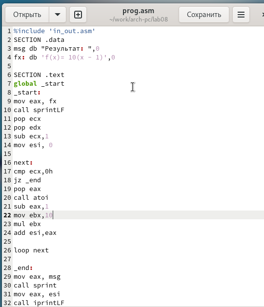{ #fig:013 width=70%, height=70% }

Проверила корректность работы, запустив программу сначала с одним аргументом.  
Например, при подстановке $f(2) = 10, f(3) = 20$.  
Затем протестировала с несколькими аргументами, убедившись в правильности вычисления суммы значений функции.

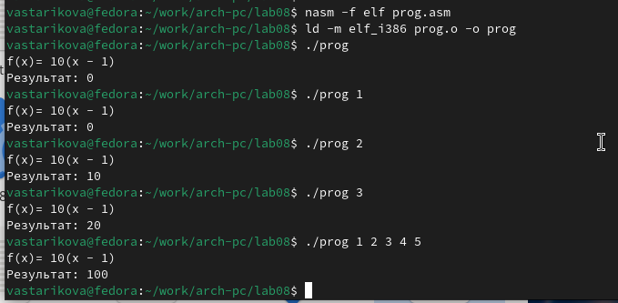{ #fig:014 width=70%, height=70% }

# Выводы

Освоили работы со стеком, циклом и аргументами на ассемблере nasm.